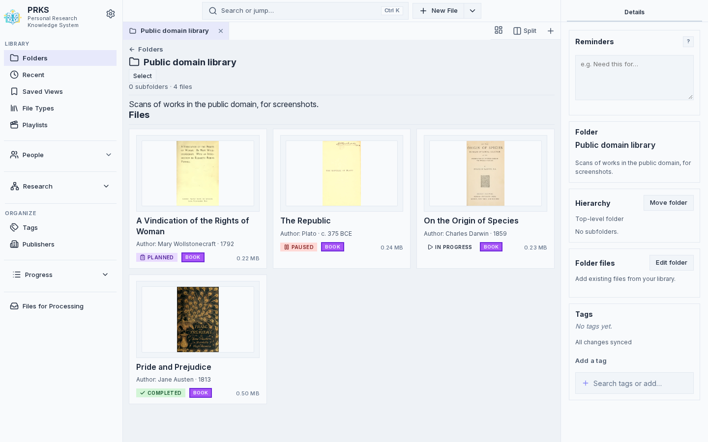
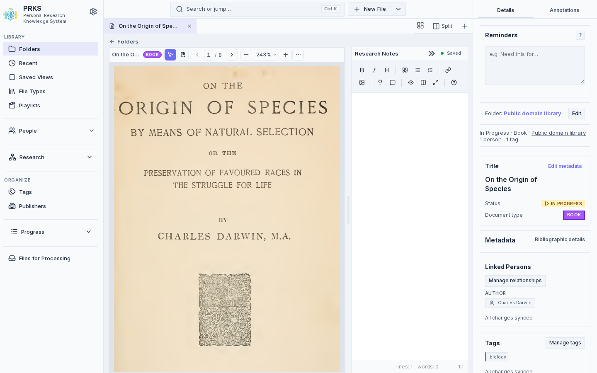
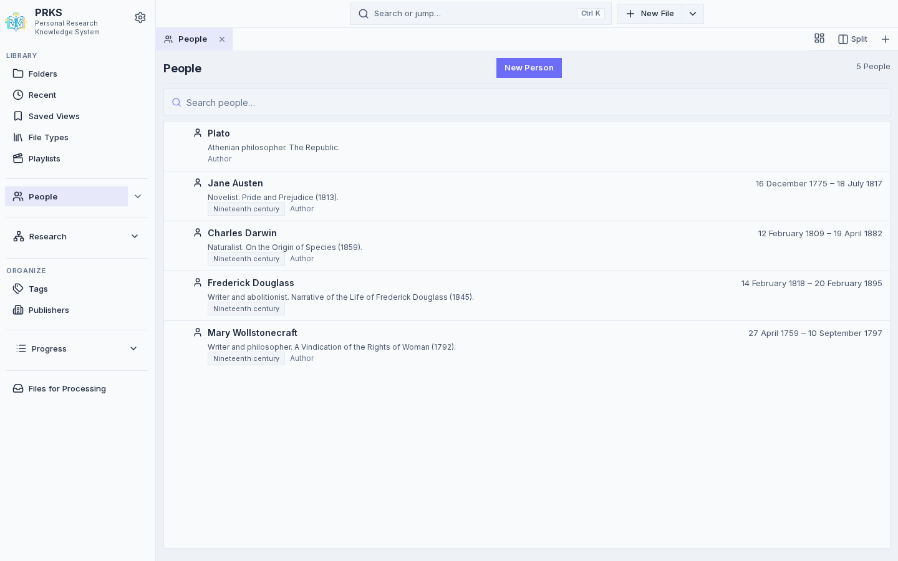

# PRKS — Personal Research Knowledge System

PRKS is a self-hosted web application for organizing research materials: PDFs, Markdown notes, and online video references. It stores everything in a SQLite database and on-disk files on your machine—no separate database server. The UI supports folders, tags, reading progress, people and bibliographic metadata, PDF annotations, and playlists for videos.







## Requirements

- **Python 3.12+**
- **PyMuPDF** 1.24.10 

The HTTP server and SQLite access use the Python standard library.

## Quick start (local)

From the repository root:

```bash
pip install -r requirements.txt
python prks_app.py
```

The process listens on **127.0.0.1:8080** only. Open [http://127.0.0.1:8080](http://127.0.0.1:8080) in a browser. No extra firewall or network setup is required for this case.

Optional port (still loopback):

```bash
python prks_app.py --port 9000
```

To listen on every local interface (LAN or VPN), pass an explicit host:

```bash
python prks_app.py --host 0.0.0.0
```

`--host localhost` also works and binds that name. The default is the literal address `127.0.0.1`, not `localhost`.

### Testing mode (Creates seperate testing database)

```bash
python prks_app.py --testing
```

This sets `PRKS_TESTING=1` and uses port **8070** by default (unless you pass `--port`). With `PRKS_STORAGE` unset it defaults to `data_testing/` so repo `data/` is untouched. You may set `PRKS_STORAGE` to an explicit safe testing root. Testing mode refuses `/data` and the repository `data/` directory (and descendants), including via symlinks. `prks_app.py` is the only process entry.

## Docker

Build:

Use `./docker-build.sh`, which builds `prks:latest` and prunes dangling images (from previous builds).

And run with Compose (from the repo root):

```bash
docker compose up -d
```

The container process binds **0.0.0.0:8080** so Docker port forwarding can reach it. Compose then publishes that port on the **host loopback** only (`127.0.0.1:8080:8080`). Container `0.0.0.0` is not the same as exposing PRKS on every host interface.

Open [http://127.0.0.1:8080](http://127.0.0.1:8080) on the machine that runs Compose. This also sets `PRKS_STORAGE=/data`, mounts **`./data` on the host to `/data` in the container**, and runs the process as **`${UID:-1000}:${GID:-1000}`** so files on the bind mount match your user. The entrypoint creates `/data/pdfs` if needed and runs `python /app/prks_app.py --host 0.0.0.0`.

To publish the host port on every interface (LAN access):

```bash
PRKS_PUBLISH_HOST=0.0.0.0 docker compose up -d
```

PRKS has no application-level authentication. Use that override only on a network you already trust, or behind an access layer you control.

## Configuration and data layout

| Variable | Purpose |
| -------- | ------- |
| `PRKS_STORAGE` | If set, root directory for persistent data. Database: `$PRKS_STORAGE/prks_data.db`. PDFs: `$PRKS_STORAGE/pdfs/`. Thumbnails: `$PRKS_STORAGE/thumbs/`. |
| `PRKS_TESTING` | When truthy (`1`, `true`, `yes`), uses testing paths and stricter checks (see testing mode above). |
| `PRKS_THUMB_LOSSLESS` | When truthy, PDF card thumbnails use lossless WebP/PNG cache encoding (debugging). Default is card-optimized lossy WebP; cache filenames use rev `_v2`. |

If `PRKS_STORAGE` is **unset**, non-testing runs use the project’s **`data/`** directory: `data/prks_data.db`, `data/pdfs/`, `data/thumbs/`, and person portrait cache `data/people/` (lossy WebP, max 512px edge, keyed by person id + `image_url` hash).

Person profile images (`GET /api/persons/{id}/profile-image`) are fetched from each person’s `image_url`, resized/transcoded like PDF card thumbnails (WebP quality 82), and cached under `$PRKS_STORAGE/people/` or `data/people/`. Updating `image_url` clears that person’s cached portraits.

Backup your database by copying `/data` folder.

## Development and tests

```bash
python run_tests.py
```

This discovers tests under `tests/`. `run_tests.py` always forces `PRKS_TESTING=1` and `PRKS_STORAGE` to the repo’s `data_testing/` directory and clears `PRKS_FOR_PROCESSING_DIR` and `PRKS_LOG_FILE`. That is stricter than `python prks_app.py --testing`, which may honor an explicit safe `PRKS_STORAGE`. Neither path uses `./data` or container `/data`.

## Project layout

| Path | Role |
| ---- | ---- |
| `prks_app.py` | Only process entry: parses `--testing`, `--port`, `--host`, starts the server. |
| `backend/server.py` | HTTP handler: static frontend, REST-style `/api/...` routes. |
| `backend/storage/config.py` | Frozen storage snapshot and env parser. |
| `backend/storage/paths.py` | Path derivation and testing-mode containment. |
| `backend/db_manager.py` | SQLite access and business logic. |
| `backend/db_schema.sql` | Schema and FTS triggers. |
| `frontend/` | Static SPA (HTML, CSS, JS), PWA assets. |
| `data/` | Default production database and files (gitignored as appropriate). |
| `data_testing/` | Test fixtures and isolated DB/PDFs for automated tests. |
| `tests/` | `unittest` modules. |

## Security note

PRKS is a single-user app with **no built-in authentication**. Direct runs bind **127.0.0.1** by default. Docker Compose publishes the host port on **127.0.0.1** by default. Reaching it from another machine requires an explicit `--host` or `PRKS_PUBLISH_HOST` override. Do that only on a trusted network.

Local browser use through `http://127.0.0.1:8080` or `http://localhost:8080` works without extra Host configuration. LAN access by IP literal (after `PRKS_PUBLISH_HOST=0.0.0.0`) also needs no `PRKS_TRUSTED_HOSTS` setting.

Custom LAN DNS names must be listed exactly:

```bash
PRKS_PUBLISH_HOST=0.0.0.0 \
PRKS_TRUSTED_HOSTS=prks.home.arpa \
docker compose up -d
```

Malformed `PRKS_TRUSTED_HOSTS` entries refuse to start the server. This variable is for extra DNS hostnames on direct HTTP/LAN access, not reverse-proxy or HTTPS termination.

The HTTP adapter validates `Host` on every request, rejects cross-origin state-changing `/api/` requests when `Origin` is supplied (`Origin: null` included), and requires `application/json` for JSON POST/PATCH bodies. Missing `Origin` remains allowed for local scripts and non-browser clients. PRKS does not send CORS headers and does not allow cross-origin API access.

These controls reduce accidental/cross-origin access and DNS-rebinding risk. They are not authentication. Public Internet exposure is still unsafe.

Research notes (`works.text_content`) are stored as raw Markdown. Preview HTML is produced by EasyMDE/Marked and then sanitized with a pinned local DOMPurify allowlist (`frontend/vendor/dompurify`, `frontend/js/markdown-sanitize.js`). Arbitrary or active HTML is not a supported contract: unsafe tags, attributes, and URL schemes are stripped from the preview only. Sanitization never rewrites saved Markdown.

The sanitizer-boundary browser fixture is not served by the app. From the repo root:

```bash
python tests/browser/serve.py
```

Open the printed `127.0.0.1` URL (and the `?dompurify=absent` / `?dompurify=unsupported` variants). The fixture must report PASS. Do not use production `data/` or a live `PRKS_STORAGE` tree for this check.
