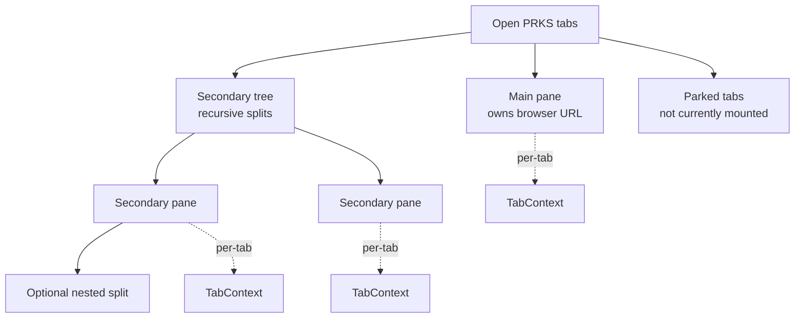

# Workspace Tabs and Split View

PRKS keeps a strip of in-app tabs under the top ribbon. Stacked mode shows one page at a time. Split view shows Main on the left and a Secondary area on the right that can itself be split further, up to 4 panes on screen at once (Main plus 3 Secondary). PRKS remembers your open tabs and split layout between sessions on this browser/device. That memory is local to the browser profile; there is no server-side workspace synchronization in this version.

Each visible pane has its own TabContext; parked tabs remain open without necessarily keeping their page resources mounted. Main is a permanent root pane beside the Secondary tree — nested splits live only under Secondary.

## Workspace tabs

Opening supported destinations creates or reuses PRKS tabs. Tabs can be switched, reordered, closed, or parked.

**Tab actions**

Right-click a tab, or press Shift+F10 while it is focused, for tab actions. From that menu you can close the tab, **Close other tabs**, or **Close tabs to the right**. Parked tabs can also be opened in split view there. A visible Secondary tab's menu additionally offers **Split right**, **Split down**, **Make main**, and **Hide from split**.

If the strip is too narrow for every tab, an overflow button at the end lists the open tabs. Choose a tab to switch to it. Parked rows also offer split view and close.

A small marker on a tab means research notes or PDF annotations are drafting, saving, or that a save failed. Failures stay visible even if you keep editing.

## Split view

1. Click **Split** beside the workspace tabs, then pick a page in **Open in split view**.
2. Or click the split icon on an already-open parked tab.

Only pages that can render beside Main appear in that picker. Already-open tabs are reused instead of duplicated.

Then the shortcuts:

- Normal click: open in the originating PRKS tab
- Ctrl/Cmd-click or middle-click: open a background PRKS tab (no extra browser page)
- Alt-click a link, or Alt+Enter in the command palette: open in split view
- Click inside a split pane: focus it (the details panel follows focus; the browser URL does not)
- Click a Secondary tab that's already visible, in the workspace strip: focus it in place (it does not become Main)
- **Make main**: **Pane actions** (`…`) on a Secondary header, or a Secondary tab/pane's context-menu action (swaps roles; URL becomes that page)
- **Hide split view**: Split control beside the workspace tabs. Parks every visible Secondary pane at once; the layout comes back with **Show split**.
- **Hide from split**: per-pane action on a Secondary tab's context menu. Keeps that pane's tab open (parked) but removes just that one pane.
- **+**: choose a page in the command palette (“Open in new tab”) and open it as a new main tab
- Close: a pane header's **×** closes that PRKS tab outright. Closing the last tab leaves Folders

Only Main controls the browser URL. The details panel follows whichever pane is focused.

### Split a pane further

Any Secondary pane can be split again: open **Pane actions** (`…`) on that header, or **Split right** / **Split down** from its tab context menu, then pick a page the same way as the main Split button. The new pane opens beside (or below) that specific pane and becomes focused. Once 4 panes are visible at once, further splitting is disabled with an explanation until you close or hide a pane — ordinary new tabs still open normally, just parked.

### Resize split view

Drag the thin divider between any two adjacent panes to resize them — this includes the root Main/Secondary divider and every divider between nested panes. Keyboard: focus a divider, then the appropriate arrow keys to resize (Shift + arrow for a larger step), Home / End for the smallest / largest allowed size for that divider. Double-click a divider to reset just that one split to its default size. Every pane keeps a comfortable minimum size. Resizing one divider never changes any other divider's size. Preferred split sizes are remembered with the rest of the workspace on this browser/device.

Cold-parked tabs do no rendering or network work until activated. Ordinary switching keeps up to three recently parked PDF Work tabs warm, preserving viewer state and resuming without another Work/PDF load. Explicit hide, close, narrow fallback, and LRU eviction still unload them.

## Drag and drop

Dragging is an optional shortcut for the same actions above — every menu command still works without it.

- Reorder tabs: drag a tab along the workspace tab bar. Dragging near either edge of an overflowing strip scrolls it.
- Create the first split: drag a parked tab into the drop region on the right side of the workspace canvas.
- Add a parked tab to split view: drag it onto an edge of an existing Secondary pane (left/right/above/below) to split that pane in that direction.
- Move a pane: drag its header's grip handle onto another pane's edge to reposition it in the split layout.
- Park a pane: drag its grip handle back onto the tab bar. Equivalent to **Hide from split**, and asks first if the pane has unsaved work.

Main can be reordered in the tab bar but is never dropped into the split layout itself — use **Make main** for that. Press Escape at any point during a drag to cancel it without changing anything.

## TabContext

Each visible tab has a TabContext. Route state, page DOM (`ctx.root` / `ctx.query`), async generation, and live resources (PDF viewer, notes editor, graph) live there. Stacked mode mounts one context. Split view mounts Main plus every visible Secondary pane (up to 4 panes total).

This rule is important for contributors: code that assumes a single document-wide route root can work in stacked mode and fail in split view.

## Persistence

Open tabs, split layout, and preferred split sizes are remembered in browser-local state. Workspace state is device/browser-profile specific and is not part of the server backup.

## Page eligibility

Not every route is appropriate in a Secondary pane. Eligibility should be explicit and centralized rather than reimplemented ad hoc by individual pages. Operational surfaces such as Processing Files can have different workspace rules from ordinary research pages.

For the implementation contract and current UI rules, use [DESIGN.md](https://github.com/Fooftilly/PRKS/blob/master/DESIGN.md), `frontend/js/tab-context.js`, and the `frontend/js/workspace-*.js` modules. Implementation/agent rules remain in [AGENTS.md](https://github.com/Fooftilly/PRKS/blob/master/AGENTS.md).
